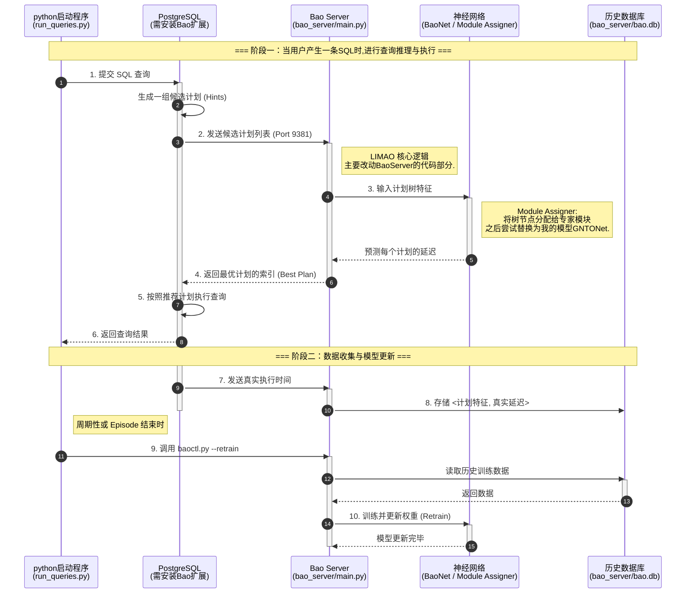

# Report

## 代码
- 代码阅读
目前的LIMAO使用的是之前Bao论文的代码框架,在他的基础上进行修改.主要改动的都是BaoServer的代码部分.
整体思想就是借用psql的扩展机制,和plan_hint这个扩展模块,来实现查询计划的推荐.

- 代码运行
目前的代码主要使用了两个数据库,一个是IMDB,一个是TPC-H,使用的版本就是psql12.5.
根据我在代码打log来观察整体的流程的输入输出,可以绘制出如下的流程图,来确保在接下来我要将我的模型集成到这个框架中时,不会出现大的问题.

## 文章阅读
阅读文章: **LIMAO: A Framework for Lifelong Modular Learned Query Optimization**
主要内容就是介绍了LIMAO的框架,以及在动态环境下的查询优化问题,和解决方式.比如在数据库的多次增删改过程中数据分布和负载发生变化,而别的模型就需要重新训练,但这个模型就不用.
(个人感觉是Online Learning的一种实现方式)
文章中解决难题是**灾难性遗忘**和**动态环境适应性差**

缺陷:
1. 目前的专家模型还是需要手动调控数量.
2. 计划处的切分也需要人为划分.
3. 基础模型相对简单.

## 个人文章优化

* **LIMAO痛点:**
    * LIMAO 成功提出了“模块化终身学习”的框架来解决灾难性遗忘问题。
    * 然而，LIMAO 的底层模块仍然依赖于传统的 **Tree-CNN** 或 **Tree-LSTM**。
    * **弱点：** Tree-CNN 假设固定的树形结构，难以捕捉长距离依赖（Long-range dependencies），且对复杂的算子交互（如复杂的 Join Order 或并行的子计划）表征能力有限。

* **我的解决方案:**
    * 1. 新模型使用: 提出一种基于 **GATv2** 的模块设计。
    * 2. 自定义新模块:**ResBlock** 用于解决GATv2的表达能力不足的问题.

## Baseline目标: 对比LIMAO
1. 强调**查询执行时间的节省 (Execution Time Gain)** 远远大于 **推理时间的增加 (Inference Overhead)**。
2.  **Ablation Study (消融实验):**
    * LIMAO + Tree-CNN
    * LIMAO + GATv2
    * LIMAO + GATv2 + ResBlock
